# CareerHub
Job portal web app using mern 

---
 ## 1.Introduction:
CareerHub is a MERN stack job portal web apppliactions allows user to apply for the jobs and can view the jobs and apply for it and can get the respective emails.Admin can manage the jobs and users and can see the emails send by user.
--- 
 ##  2.Technologies:
•	Frontend:
-React.js with Tailwind CSS and Ant Design,Axios
•	Backend:
-Node.js,Express.js,MongoDB,multer ,nodemailer
•	Authentication:
-JWT-based system with tokens and cookies
•	Tools:
-Insomania,Git,GitHub,VS Code,GoggleChrome 
---
## 3.Project Structure:
/CareerHub 
├── /frontend # React frontend (Vite-based)
│ ├── /src
│ │ ├── /components # Reusable UI components
│ │ ├── /pages # All route pages (Home, Login, Product, etc.)
│ │ ├── /services # Axios API services
│ │ ├── App.jsx
│ │ └── main.jsx
│ └── index.html
├── /backend # Node.js + Express server
│ ├── /controllers
│ ├── /models # Mongoose models: Product, User, Order, Category
│ ├── /routes # Express routes
│ ├── /middleware # Auth middleware
│ ├── uploads/ # Folder for storing uploaded images
│ └── server.js # Entry point
├── package.json # Root-level dependencies
└── README.md # Project documentation
These folders having there respective files .
Components folder includes:
•	AdminPanel
•	AdminProtectedRoute
•	AuthContext
•	JobCard
•	Navbar
•	ProtectedRoute
Pages Folder includes:
•	Admin folder :AdminContact,AdminJobs,AdminUsers
•	Contact
•	Hone
•	JobDetail
•	Login
•	My_forms
•	MyAplication
•	PostJob
•	Register
Services  Folder includes:
•	AdminServices
•	ApplicatonServices
•	AuthServices
•	ContactServices
•	JobServices
Utils folder has:
•	GetUSerDeatil
For Backend:
Config includes: 
•	Db config
Controller Folder includes:
•	AppliactionController
•	ContactController
•	JobController
•	UserController
MiddleWare Includes:
•	authMiddleware
•	chechId
•	UploadMiddleware
Models Includes:
•	ApplicationModel
•	ContactModel
•	JobModel
•	UserModel
Routes Includes:
•	ApplicationRoutes
•	ContactRoutes
•	JobRoutes
•	USerRoutes
Utils Includes:
•	CreateToken
•	SendEMail
---
## 4.Features and Functionalities:
•	User Features:
-Login/Register/Logout
-Email Verification
-Searching Jobs
-Apply Jobs
-View Jobs
-Profile
•	Admin Features:
-Login/Register/Logout
-Dashboard Access
-Searching Jobs
-Manage Users
-Mange Jobs
-Can see emails send by users
-Profile
•	User Side(Job-seekers):
- View All Job lists
- View Individual Job details
- Apply jobs(localStorage-based Appliacation tracking)
- View applied jobs(My Applications)	
•	General :
-Respossive UI
-Toast Notifications
-Dynamic routes with react router
-Scrollable sections(Home,Jobs,About,Contact) with smooth Scroll
-Contact form(submits to backend)
---

## 5.Screenshots

###  Home Page

### Login page

### Register page

### User Homepage
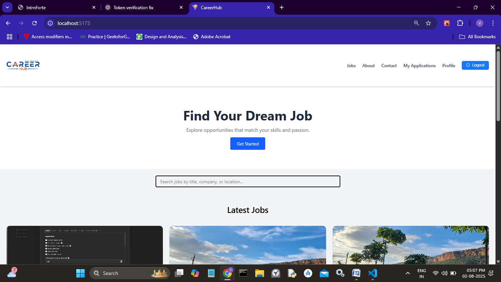

### Job 
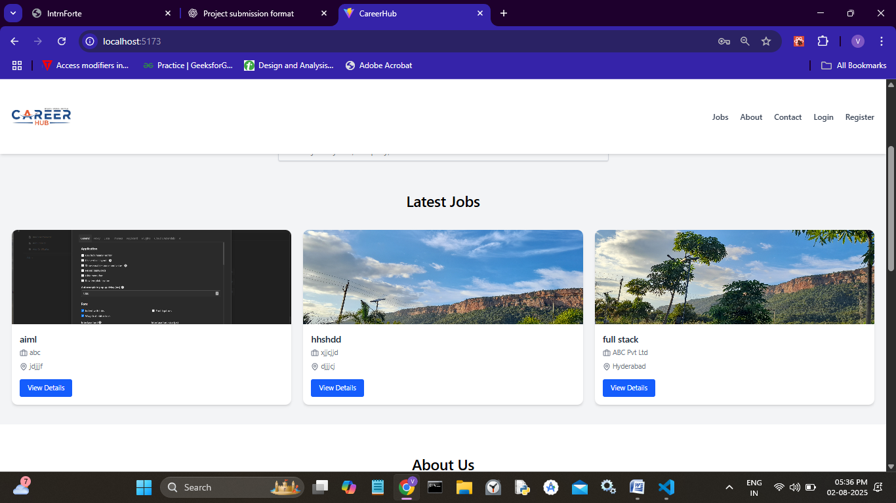

### About
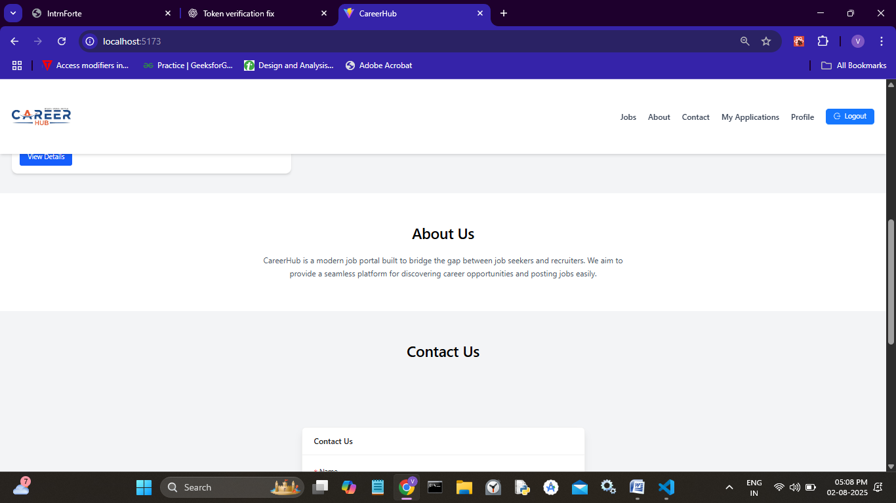

### Contact 

### Footer
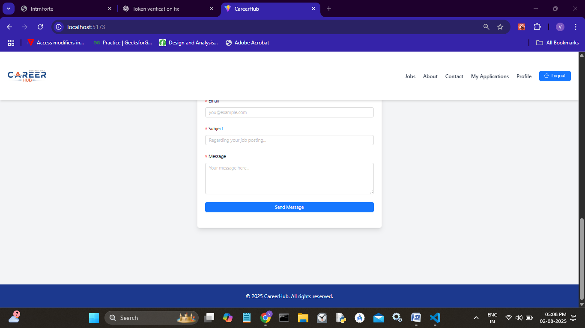

### JobDetails
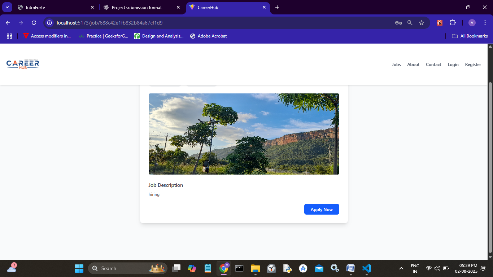

### Apply
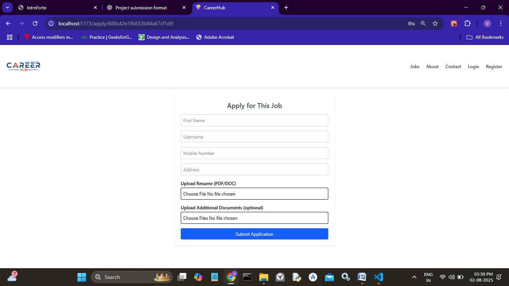

### MyApplication
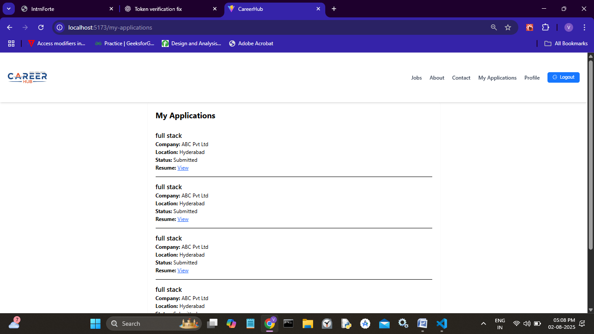

### USerProfile
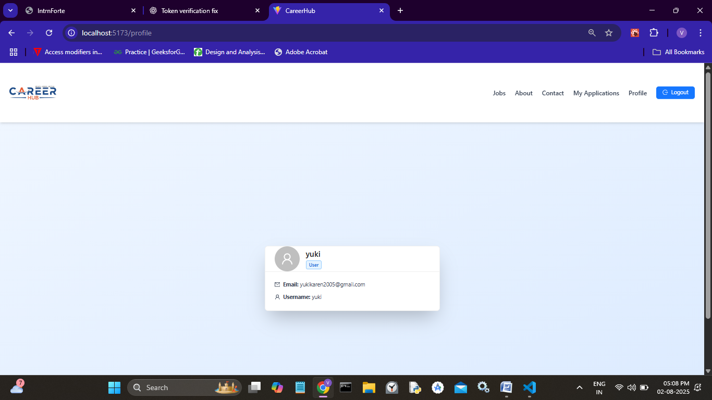

### Admin Homepage
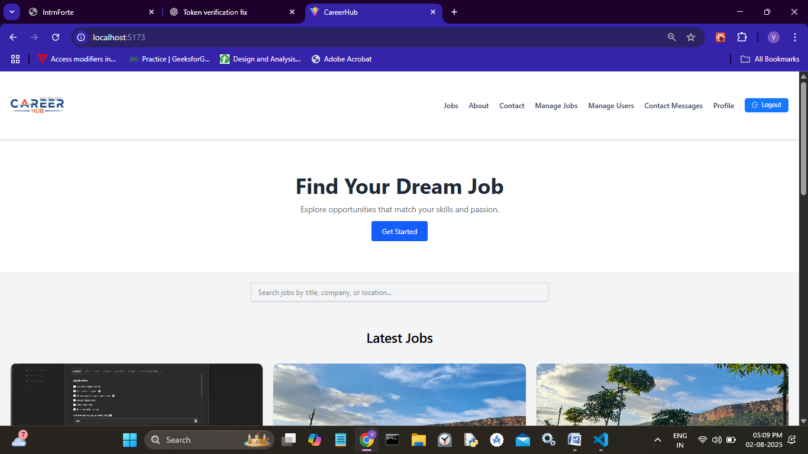

### Manage Jobs
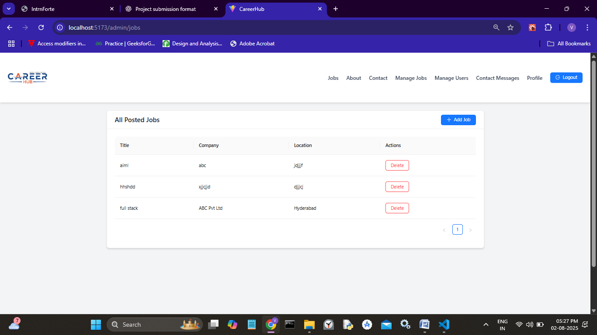

### Add Job
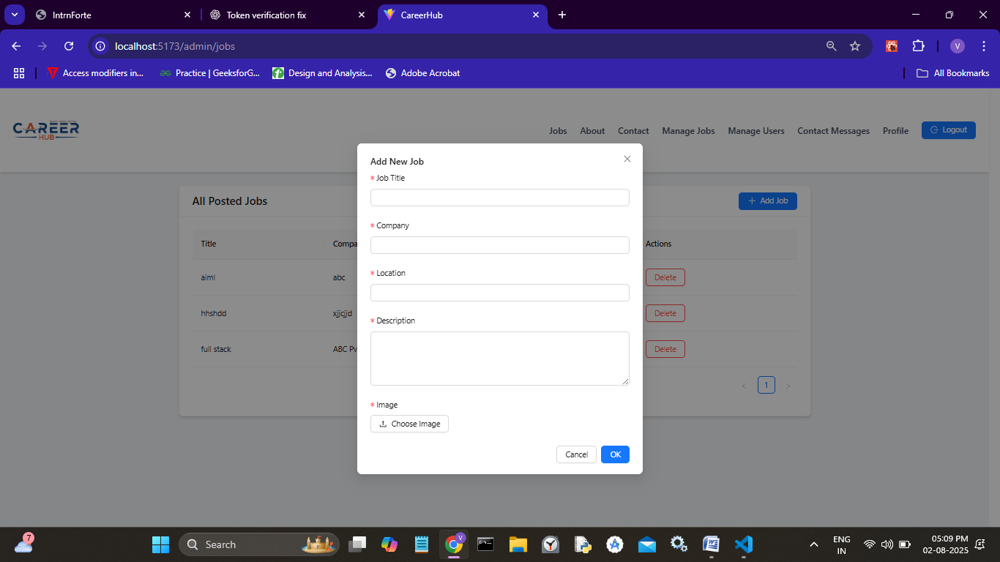

### Manage USers
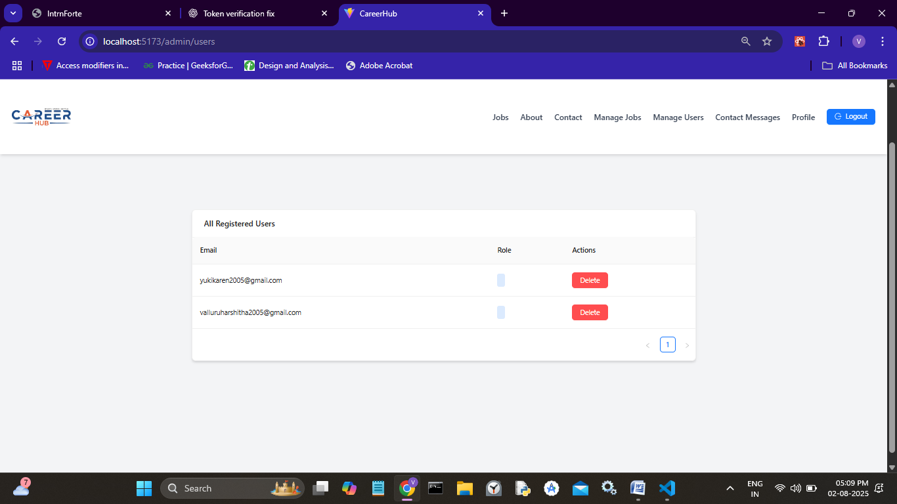

### Contact Messages
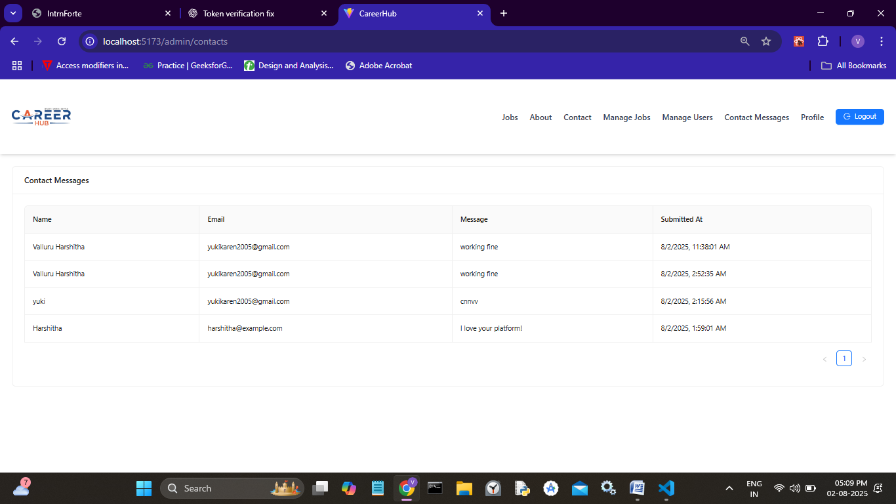

### Admin Profile
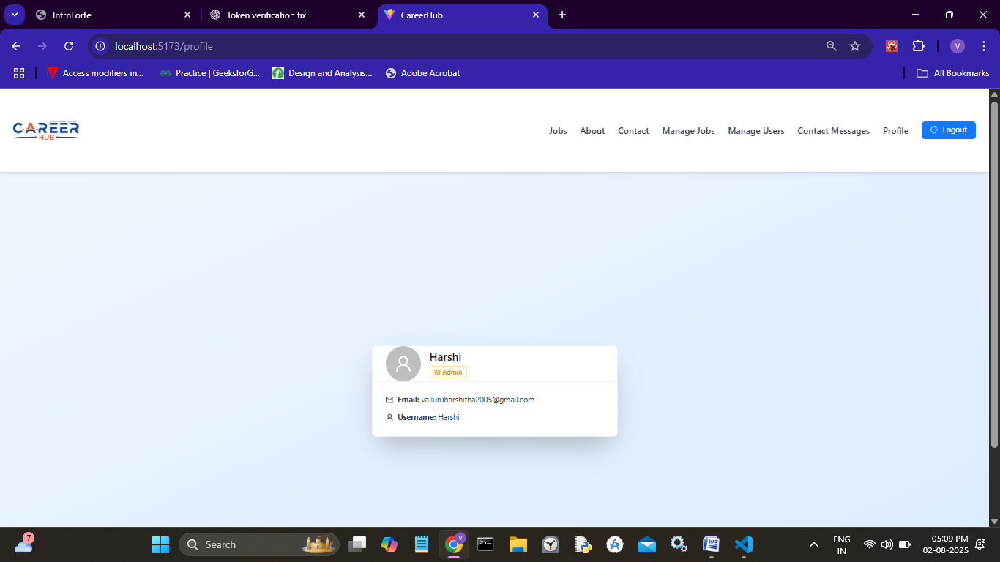

